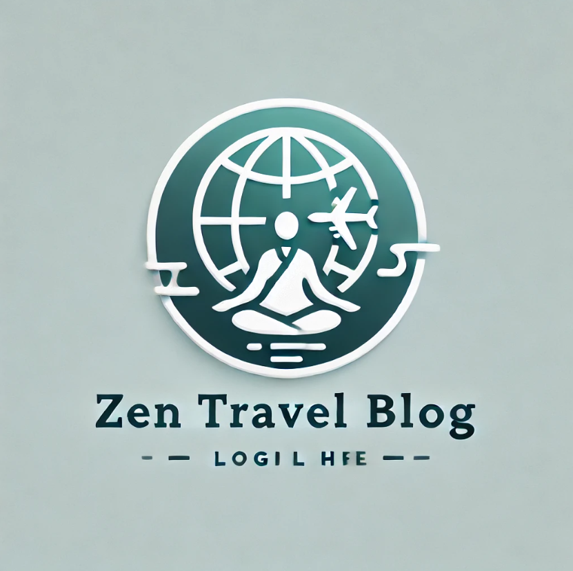

# 🌏 Zen Travel Blog 🧘‍♀️

Welcome to **Zen Travel Blog**, a serene destination for travelers seeking tranquility and mindfulness. This platform shares beautiful destinations, mindful experiences, and travel guides to inspire your next adventure.

  


---

## 🌟 Features

- 🏞️ **Curated Destinations**: Handpicked peaceful locations for inner tranquility.
- 📷 **Visual Stories**: Stunning photography to inspire your wanderlust.
- 📖 **Travel Guides**: In-depth guides for mindful journeys.
- 🧘‍♂️ **Mindful Experiences**: Activities designed to rejuvenate your spirit.
- 🌍 **Community Connection**: Share experiences with like-minded travelers.

---

## 🚀 Tech Stack

- **Frontend**: React, Tailwind CSS, Framer Motion  
- **Others**: React Router, Parallax.js  

---

## 🖼️ Screenshots

### Home Page  
  

### Featured Destinations  
  

### Contact Page 
  

---

## 🛠️ Setup Instructions

1. Clone the repository:
   ```bash
   git clone https://github.com/yourusername/zen-travel-blog.git
   ```
2. Install dependencies:
   ```bash
   npm install
   ```
3. Run the development server:
   ```bash
   npm start
   ```
4. Access the site at [http://localhost:3000](http://localhost:3000).

---

## 🧳 Contributing

We welcome contributions! To contribute:
1. Fork the repository.
2. Create a new branch (`feature/your-feature`).
3. Commit your changes.
4. Open a pull request.

---

## 📄 License

This project is licensed under the MIT License.  
See the [LICENSE](./LICENSE) file for details.

---

## 💌 Connect With Us

Have questions or suggestions? Feel free to reach out:  
- **Email**: ishandanu999@gmail.com 
- **Website**: [@Ishan](https://ishand.netlify.app)  

---

## 🧘‍♂️ Stay Mindful, Travel Peacefully! 🏕️
